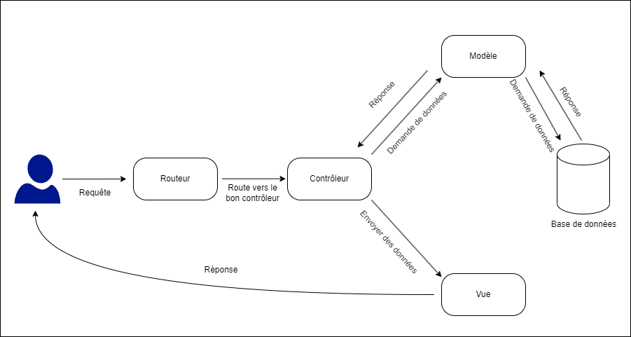

# ExamGenerator

Lien vers la documentation de l'application : https://pr3dasnip.github.io/ExamGenerator/

## Présentation

ExamGenerator est une application web permettant de créer des examens en ligne. Elle permet de créer des examens, des questions, des réponses, des groupes d'élèves (classes), des cursus, des niveaux, des matières. Elle permet également de générer des examens à partir de questions existantes, et de générer des notes pour les élèves ayant passé un examen.

Le but du projet est d'appliquer le modèle MVC (Modèle Vue Contrôleur) et d'un routeur à une application web. Le modèle MVC permet de séparer les données (Modèle), la présentation (Vue) et la logique (Contrôleur) d'une application.

### Installation

##### Etape 1.

Télécharger le fichier 'bdd.sql' et créer une nouvelle base de données mysql à l'aide d'un moteur de base de données en local sur votre machine. Importer la base de données à l'aide du fichier bdd.sql dans phpmyadmin

##### Etape 2.

Télécharger le contenu dans la branche "main" sur votre machine.

##### Etape 3.

Utiliser un outil comme Wamp ou Mamp pour recréer un environnement web localement (serveur web et sgbd), et placez le contenu de la branche "master" dans le répertoire de lecture de Wamp/Mamp. Attention, le fichier index.php doit être à la racine de ce répertoire.

##### Etape 4.

Accéder à l'application via l'URL localhost une fois l'environnement web local lancé (wamp, ou mamp). Vous devriez arriver sur une page de connexion

##### Etape 5.

Se connecter avec les identifiants suivants :  
enseignant@examgenerator.fr / 123  
eleve@examgenerator.fr / 123  
admin@examgenerator.fr / 123  

Pour un autre profil élève : vous pouvez directement cliquer sur "créer un compte"

### Auteurs

- GEILLER Valentin, Université de Haute Alsace, M1 IM
- GUEZI Yanis, Université de Haute Alsace, M1 IM
- CHUPIN Pierre, Université de Haute Alsace, M1 MIAGE
